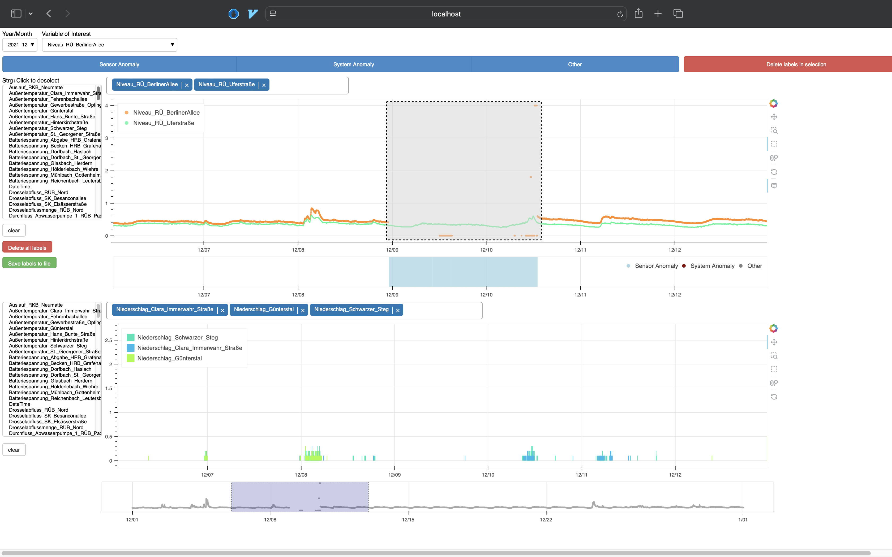

# Anomaly Detection Dashboard

Dashboard based on the [bokeh framework](http://bokeh.org) for visualization of multivariate timeseries, manual labeling of 3 classes of anomalies and evaluation of anomaly events detected by a machine learning model.

